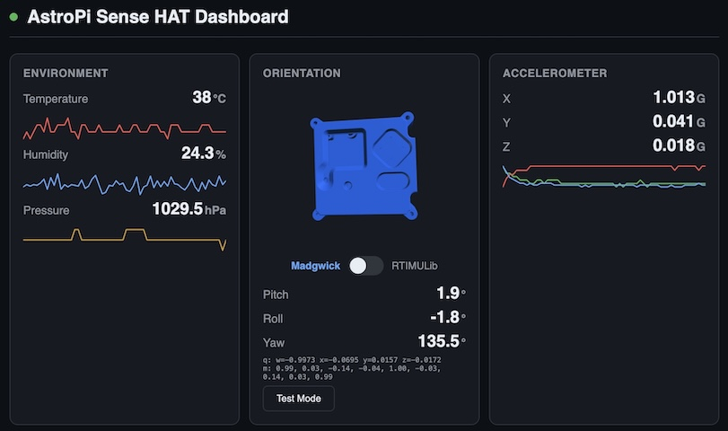

<a href="https://claude.ai"></a>

# AstroPi Sense HAT Dashboard

Real-time sensor fusion dashboard for Raspberry Pi Sense HAT. A Python WebSocket server reads 9-DOF IMU data, runs a Madgwick AHRS quaternion filter, and streams orientation and sensor data to a browser dashboard with a live 3D model of the AstroPi flight case.



## Features

- **3D orientation** -- Three.js renders an STL model of the flight case, rotated in real time by the Madgwick AHRS filter
- **Sensor readouts** -- temperature, humidity, pressure, accelerometer, gyroscope, magnetometer with sparkline history
- **LED pixel painter** -- draw on the 8x8 LED matrix from the browser
- **Text scroller** -- send scrolling messages to the LED display with color/speed controls
- **Presets** -- rainbow, heatmap, snake, sparkle, compass animations
- **Camera** -- live Pi camera stream to browser, single frame grab, and camera-to-LED preset that displays the camera feed on the 8x8 matrix
- **Filter modes** -- toggle between Madgwick (custom IMU-only), RTIMULib (built-in fusion), and test mode
- **Buttons & joystick** -- live status of all 6 flight case GPIO buttons and 5-way joystick; buttons A/B trigger shutdown/reboot on 2s hold

## Quick Start

### On the Pi

```bash
# One-time setup: create venv and install dependencies
python3 -m venv ~/venv
~/venv/bin/pip install websockets sense-hat picamera2 pillow

# Install systemd service (one-time)
sudo cp ~/projects/sensor-view/sensor-view.service /etc/systemd/system/
sudo systemctl daemon-reload
sudo systemctl enable sensor-view
sudo systemctl start sensor-view
```

### From your dev machine

```bash
# Deploy files to Pi
scp server.py index.html astropi-case.stl astropi:~/projects/sensor-view/

# Restart server
ssh astropi 'sudo systemctl restart sensor-view'
```

Then open `http://astropi:8080` in your browser.

## Architecture

```
server.py          -- Python async server: IMU -> Madgwick filter -> WebSocket
index.html         -- Browser dashboard: Three.js 3D model, charts, LED controls
astropi-case.stl   -- 3D model of the AstroPi flight case
run.sh             -- Launcher script on Pi (activates venv, runs server.py)
test_grid.html     -- Standalone LED grid test page
diag_axes.py       -- Accelerometer axis mapping diagnostic
diag_gyro.py       -- Gyroscope axis mapping diagnostic
sensor-view.service -- systemd unit file for autostart on boot
```

**server.py** reads the IMU at 20Hz, applies gyro bias correction and axis remapping for the LSM9DS1, runs the Madgwick filter to produce a quaternion, converts it to a CSS-frame rotation matrix, and broadcasts JSON over WebSocket at 10Hz. HTTP serves the static files on port 8080; WebSocket runs on port 8081.

**index.html** receives sensor JSON, applies the rotation matrix to a Three.js STL model (with CSS-to-Three.js Y-axis flip), and updates sparkline charts and readout values. It also sends commands back (LED painting, text scrolling, filter mode changes, presets). The camera panel streams live JPEG frames over WebSocket for viewing or single-frame capture.

## License

Personal project -- not licensed for redistribution.
